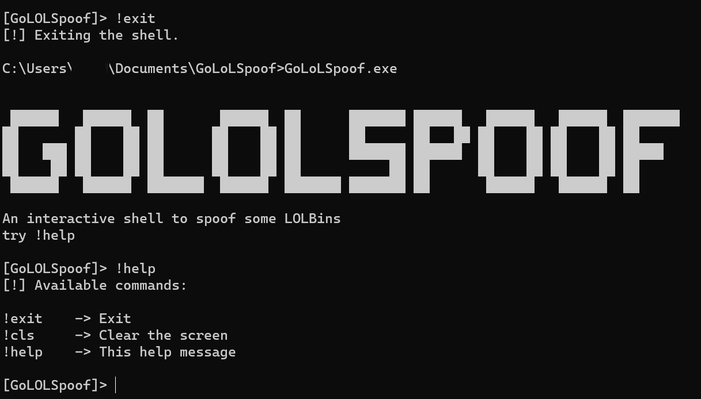
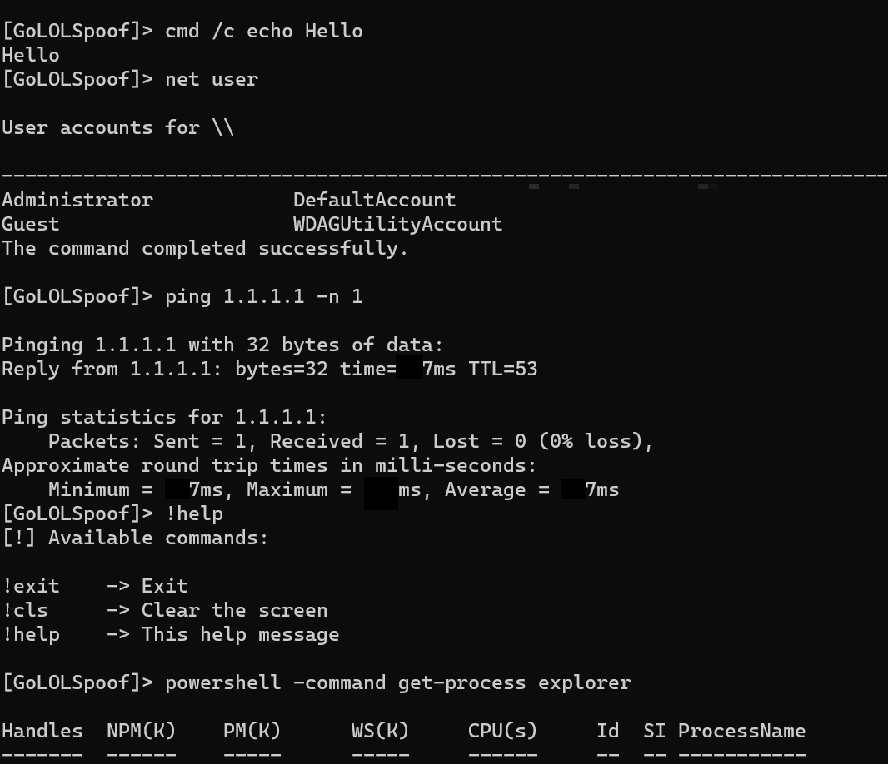

# GoLOLSpoof

GoLOLSpoof(Golang evasion tool) is a an interactive shell program that automatically spoof the command line arguments of the spawned process.

This project was inspired by [LOLSpoof](https://github.com/itaymigdal/LOLSpoof/tree/main) .
> Just call your incriminate-looking command line LOLBin (e.g.`powershell -w hidden -enc ZwBlAHQALQBwAHIAbwBjAGUA....`) and LOLSpoof will ensure that the process creation telemetry appears legitimate and clear.

It was only tested on Windows x64.

# References

- https://github.com/itaymigdal/LOLSpoof/tree/main